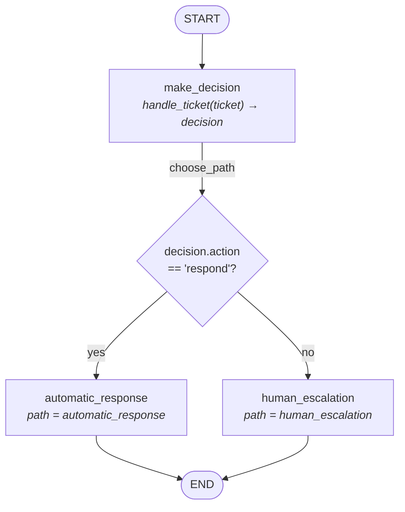

# Support Ticket Graph

LangGraph flow defined in [graph.py](app/graph.py).

## State

| Field | Type | Set by |
| --- | --- | --- |
| `ticket` | `str` | caller (graph input) |
| `decision` | `AgentDecision` | `make_decision` |
| `path` | `str` | `automatic_response` / `human_escalation` |
